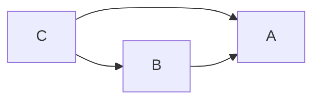

# Summer

### 什么是Summer？

C++作为一门多范式的编程语言，为各类“魔法”编程奠定了雄厚的语法糖基础。而与之相反，开源社区的发展较其他编程语言，如Java/Python/Go等等，显得较为老迈横秋。以Java的顶级开源框架Springboot为例，以依赖注入为基础，衍生的各类层出不穷的Springboot开源生态，正在蓬勃发展。

而C++由于语言特性导致的头文件传染和封装相关的问题，依赖注入显得更有必要。我们知道，Springboot所实现的依赖注入是以Java反射为基础，而C++对反射的支持如同隔靴搔痒，直到C++26中才形成正式提案。而C++26对于当今的开发者而言，由于各类历史债务问题，显得格外“遥远”。

因此Summer尝试基于Boost.describe和Boost.hana两大组件，试图在C++17的标准背景下，实现C++的静态反射，并以Boost.hana异构 编程范式和一些模板“黑魔法”，构建编译期的有向无环图DAG，达到类似Springboot的依赖注入效果。


### 快速入门

#### 如何安装

Summer是一个纯头文件的库，依赖只有Boost，所以请直接把summer目录拷贝到你需要的地方吧。

#### 快速上手

正如我们上面所提到，C++17是通过Boost.describe实现的静态反射，因此我们不得不对待注入的类进行必要的宏处理，我们假定如下简单的案例：

```c++
// 纯虚类，起到接口的作用
class A {
public:
  virtual ~A() = default;
  virtual void testA() = 0;
};
// A接口的实现类
class AImpl : public A {
public:
  // INJECT_CONSTRUCTOR为构造函数的宏处理，类似Springboot的@Autowired注解
  INJECT_CONSTRUCTOR(AImpl, ()) {
    std::cout << "NormalCase AImpl constructor" << std::endl;
  }
  void testA() override { std::cout << "print a test" << std::endl; }

  ~AImpl() override { std::cout << "NormalCase AImpl destructor" << std::endl; }
  //Boost.describe所提供的编译期获得类的继承关系的能力
  BOOST_DESCRIBE_CLASS(AImpl, (A), (), (), ())
};
```

经过如上的`INJECT_CONSTRUCTOR`和`BOOST_DESCRIBE_CLASS`，其实我们已经能够在编译期判断一个类，依赖了什么接口，实现了什么接口，这转化到有向无环图，实际上就是一个点的`Indegree`和`Outdegree`，依此为思路，我们继续定义如下的类：

```c++

class B {
public:
  virtual ~B() = default;
  virtual void testB() = 0;
};
// BImpl依赖了A，实现了B
class BImpl : public B {
public:
  // INJECT_EXPLICIT_CONSTRUCTOR 在 INJECT_CONSTRUCTOR基础之上增加了explicit关键字
  INJECT_EXPLICIT_CONSTRUCTOR(BImpl, (const std::shared_ptr<A> &a)) : a(a) {
    std::cout << "NormalCase BImpl constructor" << std::endl;
  }

  void testB() override { std::cout << "print b test" << std::endl; }

  ~BImpl() override { std::cout << "NormalCase BImpl destructor" << std::endl; }

private:
  std::shared_ptr<A> a;
  BOOST_DESCRIBE_CLASS(BImpl, (B), (), (), ())
};

class C {
public:
  virtual ~C() = default;
  virtual void testC() = 0;
};
// CImpl依赖了A和B，实现了C
class CImpl : public C {
public:
  INJECT_CONSTRUCTOR(CImpl,
                     (const std::shared_ptr<A> &a, const std::shared_ptr<B> &b))
      : a(a), b(b) {
    std::cout << "NormalCase CImpl constructor" << std::endl;
  }

  void testC() override { std::cout << "print c test" << std::endl; }

  ~CImpl() override { std::cout << "NormalCase CImpl destructor" << std::endl; }

private:
  std::shared_ptr<A> a;
  std::shared_ptr<B> b;

  BOOST_DESCRIBE_CLASS(CImpl, (C), (), (), ())
};
```

很显然，ABC三个类是如下的依赖关系：



这是一个非常简单的有向无环图。接下来，我们可以将它们放入BeanFactory中：

```c++
#include "Summer.h"

using namespace boost;
using namespace summer;

TEST_F(BeanTest, test_construct_beans_by_bean_factory) {
  // 将拥有正确依赖关系的三个类放入BeanFactory模板参数中
  // C++难以支持类似Java的Scan Package的能力，这种方案是一种妥协
  auto container = ContainerBuilder<>().WithBeans<CImpl, BImpl, AImpl>().Build();
  // 通过Factory的静态方法，我们可以在业务最上层取出相应的接口类
  // GetShared取出的是std::share_ptr类型的对象指针
  auto a = container.GetShared<A>();
  auto b = container.GetShared<B>();
  auto c = container.GetShared<C>();
  // 如果你比较无聊，你甚至也可以取出实现类
  auto a1 = container.GetShared<AImpl>();
  auto b1 = container.GetShared<BImpl>();
  auto c1 = container.GetShared<CImpl>();
  // 但两种方式返回的同一个内存地址
  EXPECT_EQ(a.get(), a1.get());
  EXPECT_EQ(b.get(), b1.get());
  EXPECT_EQ(c.get(), c1.get());
}
```

至此，我们成功对三个拥有合理依赖关系的类，进行了自动依赖注入。

#### 工厂方法注入

当然，我们在实际开发过程中，待注入的类不一定有具体的构造方法，取而代之是工厂方法+基类的使用场景，这个时候我们要通过工厂方法注入。

假定继承上述的案例，我们定义一个`CImpl`类的工厂方法：

```c++
// 没错，工厂方法也可以类似于构造函数注入的方式，从IoC容器中获取到其他的实体类
inline CImpl* createCImpl(std::shared_ptr<A> a, std::shared_ptr<B> b) {
    return new CImpl(a, b);
}
```

此场景下，我们的注入方式为：

```c++
TEST_F(BeanTest, test_construct_beans_with_creator_function) {
    auto container = ContainerBuilder<>()
                         // 这里不再注入CImpl
                         .WithBeans<BImpl, AImpl>()
                         // 取而代之，我们注入相应的工厂方法
                         .WithCreators<createCImpl>()
                         .Build();
    auto a = container.GetShared<A>();
    auto b = container.GetShared<B>();
    auto c = container.GetShared<C>();
    auto a1 = container.GetShared<AImpl>();
    auto b1 = container.GetShared<BImpl>();
    auto c1 = container.GetShared<CImpl>();
    EXPECT_EQ(a.get(), a1.get());
    EXPECT_EQ(b.get(), b1.get());
    EXPECT_EQ(c.get(), c1.get());
}
```

依旧可以相当简化地进行依赖注入过程。

#### 构造函数入参问题

与Java不同的是，C++拥有多种指针类型或者引用，来进行对象的传递。这块的特性是C++所独有的。Summer所支持的入参类型比较丰富：

* 裸指针（*）
* 智能指针（std::shared_ptr）
* 智能指针（std::unique_ptr）
* 引用类型（&）（还在调试中。。。。）
* std::list和std::vector与上述指针类型嵌套的类型

值的注意的是，与Springboot的默认设置类似，除std::unique_ptr以外的入参类型，都是共享的一个实例。但在std::unique_ptr入参类型情况下，由于唯一所有权的特殊性，将在每次调用构造函数时生存新的实例，与Springboost的prototype装载模式类型。

### 请注意

当前正处于较为早期的施工阶段，欢迎提issue～
