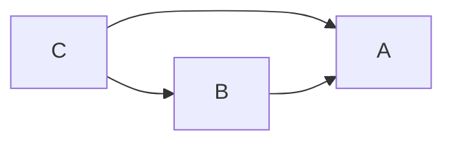
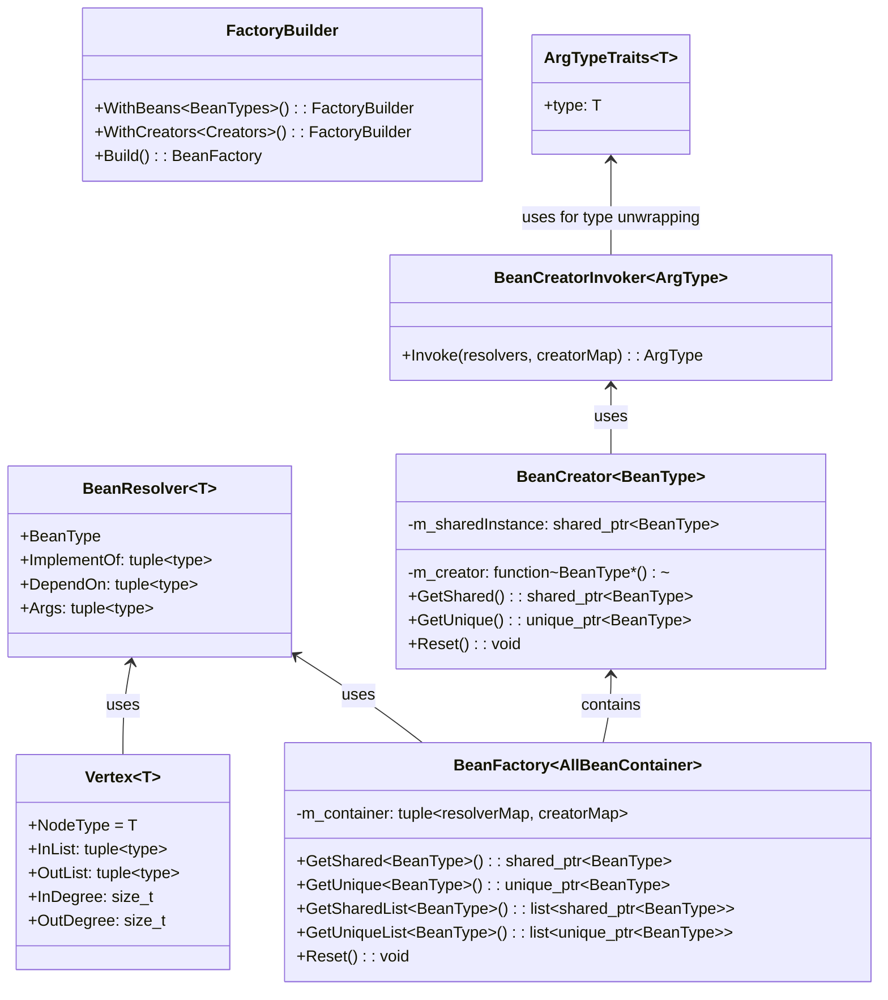

**中文** | [English](./README.md)

# Summer

### What is Summer?

C++ is a multi-paradigm programming language that provides a solid foundation for various "magic" programming techniques. However, unlike other programming languages such as Java, Python, and Go, the C++ open-source community has been relatively slow in developing ecosystem around dependency injection frameworks. Take Java's Spring Boot as an example: based on dependency injection, it has spawned a thriving ecosystem of Spring Boot projects.

Due to C++ language characteristics like header file contagion and encapsulation issues, dependency injection becomes even more necessary. As we know, Spring Boot's dependency injection is based on Java reflection. C++ has very limited reflection support - it wasn't until C++26 that a formal proposal for reflection was formed. For developers today, dealing with historical baggage makes C++26 seem "far away."

Therefore, Summer attempts to implement static reflection in C++17 by leveraging Boost.Describe and Boost.Hana. Using Boost.Hana's heterogeneous programming paradigm and some template "black magic," Summer constructs a compile-time Directed Acyclic Graph (DAG) to achieve dependency injection similar to Spring Boot.

### Quick Start

#### Installation

Summer is a header-only library with only Boost as a dependency. Simply copy the summer directory to your project.

#### Quick Example

As mentioned above, C++17 achieves static reflection through Boost.Describe, so we must apply necessary macros to classes we want to inject. Consider the following simple example:

```c++
// Abstract class acting as an interface
class A {
public:
  virtual ~A() = default;
  virtual void testA() = 0;
};

// Implementation of A
class AImpl : public A {
public:
  // INJECT_CONSTRUCTOR macro handles constructor injection, similar to Spring's @Autowired
  INJECT_CONSTRUCTOR(AImpl, ()) {
    std::cout << "NormalCase AImpl constructor" << std::endl;
  }
  void testA() override { std::cout << "print a test" << std::endl; }

  ~AImpl() override { std::cout << "NormalCase AImpl destructor" << std::endl; }
  // BOOST_DESCRIBE_CLASS provides compile-time inheritance information
  BOOST_DESCRIBE_CLASS(AImpl, (A), (), (), ())
};
```

With `INJECT_CONSTRUCTOR` and `BOOST_DESCRIBE_CLASS`, we can determine at compile time what interfaces a class implements and what dependencies it requires. In terms of a DAG, this translates to `Indegree` and `Outdegree` of each vertex. Based on this, let's continue defining more classes:

```c++

class B {
public:
  virtual ~B() = default;
  virtual void testB() = 0;
};
// BImpl depends on A and implements B
class BImpl : public B {
public:
  // INJECT_EXPLICIT_CONSTRUCTOR adds explicit keyword on top of INJECT_CONSTRUCTOR
  INJECT_EXPLICIT_CONSTRUCTOR(BImpl, (const std::shared_ptr<A> &a)) : a(a) {
    std::cout << "NormalCase BImpl constructor" << std::endl;
  }

  void testB() override { std::cout << "print b test" << std::endl; }

  ~BImpl() override { std::cout << "NormalCase BImpl destructor" << std::endl; }

private:
  std::shared_ptr<A> a;
  BOOST_DESCRIBE_CLASS(BImpl, (B), (), (), ())
};

class C {
public:
  virtual ~C() = default;
  virtual void testC() = 0;
};
// CImpl depends on A and B, implements C
class CImpl : public C {
public:
  INJECT_CONSTRUCTOR(CImpl,
                     (const std::shared_ptr<A> &a, const std::shared_ptr<B> &b))
      : a(a), b(b) {
    std::cout << "NormalCase CImpl constructor" << std::endl;
  }

  void testC() override { std::cout << "print c test" << std::endl; }

  ~CImpl() override { std::cout << "NormalCase CImpl destructor" << std::endl; }

private:
  std::shared_ptr<A> a;
  std::shared_ptr<B> b;

  BOOST_DESCRIBE_CLASS(CImpl, (C), (), (), ())
};
```

The dependency relationship between A, B, and C is:


```mermaid
graph LR;
		C-->B
		C-->A
		B-->A
```

This is a very simple DAG. Next, let's put them into a BeanFactory:

```c++
#include "Summer.h"

using namespace boost;
using namespace summer;

TEST_F(BeanTest, test_construct_beans_by_bean_factory) {
  // Put the three classes with correct dependency relationships into BeanFactory template
  // C++ lacks the ability to scan packages like Java, so this approach is a compromise
  auto factory = FactoryBuilder<>().WithBeans<CImpl, BImpl, AImpl>().Build();
  // Through Factory methods, we can retrieve interface classes at the business layer
  // GetShared returns std::shared_ptr
  auto a = factory.GetShared<A>();
  auto b = factory.GetShared<B>();
  auto c = factory.GetShared<C>();
  // You can also retrieve implementation classes if needed
  auto a1 = factory.GetShared<AImpl>();
  auto b1 = factory.GetShared<BImpl>();
  auto c1 = factory.GetShared<CImpl>();
  // Both methods return the same memory address
  EXPECT_EQ(a.get(), a1.get());
  EXPECT_EQ(b.get(), b1.get());
  EXPECT_EQ(c.get(), c1.get());
}
```

Now we have successfully performed automatic dependency injection for three classes with correct dependency relationships.

#### Factory Method Injection

In real development, classes to be injected may not have concrete constructors. Instead, we might have factory methods combined with base classes. In this case, we use factory method injection.

Building on the above example, let's define a factory method for `CImpl`:

```c++
// Factory methods can also inject dependencies from the IoC container
inline CImpl* createCImpl(std::shared_ptr<A> a, std::shared_ptr<B> b) {
    return new CImpl(a, b);
}
```

In this scenario, the injection is done as follows:

```c++
TEST_F(BeanTest, test_construct_beans_with_creator_function) {
    auto factory = FactoryBuilder<>()
                         // No longer inject CImpl directly
                         .WithBeans<BImpl, AImpl>()
                         // Instead, inject the factory method
                         .WithCreators<createCImpl>()
                         .Build();
    auto a = factory.GetShared<A>();
    auto b = factory.GetShared<B>();
    auto c = factory.GetShared<C>();
    auto a1 = factory.GetShared<AImpl>();
    auto b1 = factory.GetShared<BImpl>();
    auto c1 = factory.GetShared<CImpl>();
    EXPECT_EQ(a.get(), a1.get());
    EXPECT_EQ(b.get(), b1.get());
    EXPECT_EQ(c.get(), c1.get());
}
```

Dependency injection is still very straightforward.

#### Constructor Parameter Types

Unlike Java, C++ has multiple pointer types and references for object passing. This is unique to C++. Summer supports various parameter types:

* Smart pointer (`std::shared_ptr`)
* Smart pointer (`std::unique_ptr`)
* `std::list` and `std::vector` nested with the above pointer types

Note that, similar to Spring Boot's default behavior, all parameter types except `std::unique_ptr` share the same instance. However, with `std::unique_ptr`, due to its unique ownership characteristic, a new instance is created each time the constructor is called, similar to Spring Boot's prototype scope.

## Implementation Principles

### Core Class Diagram


```mermaid
classDiagram
    class BeanResolver~T~ {
        +BeanType
        +ImplementOf: tuple~type~
        +DependOn: tuple~type~
        +Args: tuple~type~
    }

    class Vertex~T~ {
        +NodeType = T
        +InList: tuple~type~
        +OutList: tuple~type~
        +InDegree: size_t
        +OutDegree: size_t
    }

    class BeanCreator~BeanType~ {
        -m_creator: function~BeanType*()~
        -m_sharedInstance: shared_ptr~BeanType~
        +GetShared(): shared_ptr~BeanType~
        +GetUnique(): unique_ptr~BeanType~
        +Reset(): void
    }

    class BeanCreatorInvoker~ArgType~ {
        +Invoke(resolvers, creatorMap): ArgType
    }

    class BeanFactory~AllBeanContainer~ {
        -m_container: tuple~resolverMap, creatorMap~
        +GetShared~BeanType~(): shared_ptr~BeanType~
        +GetUnique~BeanType~(): unique_ptr~BeanType~
        +GetSharedList~BeanType~(): list~shared_ptr~BeanType~~
        +GetUniqueList~BeanType~(): list~unique_ptr~BeanType~~
        +Reset(): void
    }

    class FactoryBuilder {
        +WithBeans~BeanTypes~(): FactoryBuilder
        +WithCreators~Creators~(): FactoryBuilder
        +Build(): BeanFactory
    }

    class ArgTypeTraits~T~ {
        +type: T
    }

    BeanResolver <-- Vertex : uses
    BeanResolver <-- BeanFactory : uses
    BeanCreator <-- BeanFactory : contains
    BeanCreatorInvoker <-- BeanCreator : uses
    ArgTypeTraits <-- BeanCreatorInvoker : uses for type unwrapping
```

### Design Philosophy

#### 1. Static Reflection and Type Registration

Summer uses Boost.Describe to extract class inheritance relationships at compile time. Combined with `INJECT_CONSTRUCTOR` and `INJECT_EXPLICIT_CONSTRUCTOR` macros, constructor signatures are registered into the type system.

The key type `BeanResolver<T>` uses template specialization:
- For classes using macros: extracts `ImplementOf` (all implemented interfaces) and `DependOn` (constructor parameter types) from `FactortMethodType`
- For factory methods: extracts information from `CreatorWrapper<CreatorFunc>`
- For simple classes without macros: provides default implementation

#### 2. Directed Acyclic Graph (DAG) Construction

Each Bean is modeled as a vertex in the DAG:
- **OutList (OutDegree)**: Other Bean types this Bean depends on
- **InList (InDegree)**: All types that implement this Bean (including itself)

Through `Vertex::GetBeansInOrder`, the framework performs topological sorting at compile time:
1. Find all vertices with no dependencies (out-degree = 0)
2. Remove these vertices and update dependency relationships of remaining vertices
3. Repeat until all vertices are processed
4. If remaining vertices still have dependencies, report circular dependency error

#### 3. Shared vs Unique Instances

**Shared Instance (Singleton pattern)**:
```cpp
// Constructor.h
template <typename BeanType>
class BeanCreator {
    std::shared_ptr<BeanType> m_sharedInstance;
public:
    std::shared_ptr<BeanType> GetShared() {
        if (m_sharedInstance == nullptr) {
            m_sharedInstance = std::shared_ptr<BeanType>(m_creator());
        }
        return m_sharedInstance;
    }
};
```

**Unique Instance (Prototype pattern)**:
```cpp
template <typename BeanType>
class BeanCreator {
public:
    std::unique_ptr<BeanType> GetUnique() {
        return std::unique_ptr<BeanType>(m_creator());
    }
};
```

#### 4. Parameter Type Unwrapping

The `ArgTypeTraits` template "unwraps" various parameter types to raw Bean types:

| Original Type | Unwrapped |
|---------------|-----------|
| `const std::shared_ptr<A>&` | `A` |
| `std::unique_ptr<A>` | `A` |
| `const std::list<std::shared_ptr<A>>&` | `A` |
| `std::vector<std::unique_ptr<A>>` | `A` |

This allows the framework to uniformly handle parameters with different wrapper types.

#### 5. BeanCreatorInvoker Dispatch

`BeanCreatorInvoker<ArgType>` dispatches to different instance acquisition strategies based on parameter type:

```cpp
// shared_ptr type - returns shared instance
template <typename ArgType>
struct BeanCreatorInvoker<std::shared_ptr<ArgType>> {
    static constexpr std::shared_ptr<ArgType> Invoke(...) {
        return creator->GetShared();  // Reuse singleton
    }
};

// unique_ptr type - returns new instance
template <typename ArgType>
struct BeanCreatorInvoker<std::unique_ptr<ArgType>> {
    static constexpr std::unique_ptr<ArgType> Invoke(...) {
        return creator->GetUnique();  // Create new instance
    }
};

// list type - batch acquisition
template <typename ArgType>
struct BeanCreatorInvoker<std::list<ArgType>> {
    static constexpr std::list<ArgType> Invoke(...) {
        // Call Invoke for each resolver, return list
    }
};
```

### Bean Creation Flow

```
┌─────────────────────────────────────────────────────────────────┐
│                     Compile-Time Build Phase                     │
├─────────────────────────────────────────────────────────────────┤
│ 1. FactoryBuilder::Build()                                       │
│    └─> Beans::CreateFactory(beans)                             │
│         │                                                        │
│         ├─> Vertex::ToVertexes(beans)                          │
│         │   Convert all Beans to DAG vertices                    │
│         │                                                        │
│         ├─> Vertex::GetBeansInOrder()                           │
│         │   Compile-time topological sort                       │
│         │   ├─> Find vertices with no dependencies (out=0)     │
│         │   ├─> Remove and update dependency relationships     │
│         │   └─> Repeat until all vertices processed             │
│         │                                                        │
│         └─> Build resolverMap and creatorMap                    │
│             resolverMap: BeanType -> resolvers tuple              │
│             creatorMap: resolver -> BeanCreator pointer          │
└─────────────────────────────────────────────────────────────────┘
                              │
                              ▼
┌─────────────────────────────────────────────────────────────────┐
│                     Runtime Acquisition Phase                     │
├─────────────────────────────────────────────────────────────────┤
│ 2. BeanFactory::GetShared<A>()                                   │
│    │                                                             │
│    ├─> FindResolvers<A>()                                      │
│    │   Look up A's resolvers in resolverMap                      │
│    │                                                             │
│    └─> FindCreator(resolver) -> creator                         │
│        │                                                         │
│        └─> creator->GetShared()                                 │
│            │                                                     │
│            ├─> If m_sharedInstance exists, return directly       │
│            │                                                     │
│            └─> Otherwise call lambda to create instance:        │
│                │                                                 │
│                ├─> Get constructor parameters                     │
│                │   BeanCreatorInvoker<ArgType>::Invoke(...)      │
│                │   ├─> ArgTypeTraits unwrap to get raw type      │
│                │   ├─> Look up dependent resolver in resolverMap │
│                │   └─> Recursively call creator->GetShared/Unique│
│                │                                                 │
│                └─> Call new or factory method to create Bean    │
└─────────────────────────────────────────────────────────────────┘
```

### Complete Example Analysis

Taking `FactoryBuilder<>().WithBeans<CImpl, BImpl, AImpl>().Build()` as an example:

**Compile-time**:
1. Define three BeanResolvers: AImpl, BImpl, CImpl
2. Build DAG:
   - AImpl: no dependencies (out-degree 0)
   - BImpl: depends on A (out-degree 1)
   - CImpl: depends on A and B (out-degree 2)
3. Topological sort result order: AImpl -> BImpl -> CImpl
4. Create creatorMap:
   - AImpl's creator: no parameters, directly new AImpl()
   - BImpl's creator: needs A, finds AImpl's creator via resolverMap, calls GetShared()
   - CImpl's creator: needs A and B, same as above

**Runtime to get C**:
1. `GetShared<C>()` finds C's resolver -> CImpl
2. Call CImpl's creator:
   - Parameter A: unwrap via ArgTypeTraits to A, find AImpl's creator via resolverMap, call GetShared()
   - Parameter B: unwrap via ArgTypeTraits to B, find BImpl's creator via resolverMap, call GetShared()
   - Create CImpl instance
3. Return C's shared_ptr

### Note

This project is in early stages. Issues and PRs are welcome!