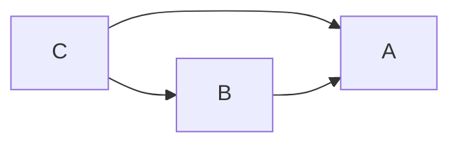
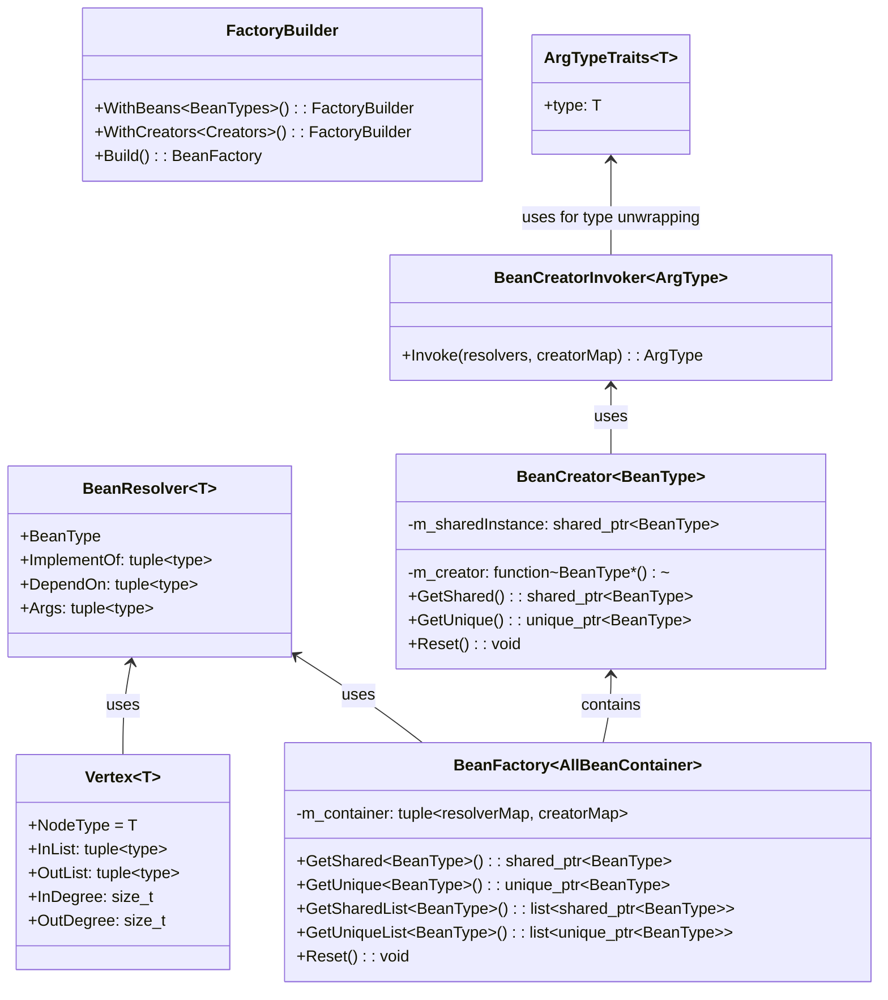

# Summer

### 什么是Summer？

C++作为一门多范式的编程语言，为各类“魔法”编程奠定了雄厚的语法糖基础。而与之相反，开源社区的发展较其他编程语言，如Java/Python/Go等等，显得较为老迈横秋。以Java的顶级开源框架Springboot为例，以依赖注入为基础，衍生的各类层出不穷的Springboot开源生态，正在蓬勃发展。

而C++由于语言特性导致的头文件传染和封装相关的问题，依赖注入显得更有必要。我们知道，Springboot所实现的依赖注入是以Java反射为基础，而C++对反射的支持如同隔靴搔痒，直到C++26中才形成正式提案。而C++26对于当今的开发者而言，由于各类历史债务问题，显得格外“遥远”。

因此Summer尝试基于Boost.describe和Boost.hana两大组件，试图在C++17的标准背景下，实现C++的静态反射，并以Boost.hana异构 编程范式和一些模板“黑魔法”，构建编译期的有向无环图DAG，达到类似Springboot的依赖注入效果。


### 快速入门

#### 如何安装

Summer是一个纯头文件的库，依赖只有Boost，所以请直接把summer目录拷贝到你需要的地方吧。

#### 快速上手

正如我们上面所提到，C++17是通过Boost.describe实现的静态反射，因此我们不得不对待注入的类进行必要的宏处理，我们假定如下简单的案例：

```c++
// 纯虚类，起到接口的作用
class A {
public:
  virtual ~A() = default;
  virtual void testA() = 0;
};
// A接口的实现类
class AImpl : public A {
public:
  // INJECT_CONSTRUCTOR为构造函数的宏处理，类似Springboot的@Autowired注解
  INJECT_CONSTRUCTOR(AImpl, ()) {
    std::cout << "NormalCase AImpl constructor" << std::endl;
  }
  void testA() override { std::cout << "print a test" << std::endl; }

  ~AImpl() override { std::cout << "NormalCase AImpl destructor" << std::endl; }
  //Boost.describe所提供的编译期获得类的继承关系的能力
  BOOST_DESCRIBE_CLASS(AImpl, (A), (), (), ())
};
```

经过如上的`INJECT_CONSTRUCTOR`和`BOOST_DESCRIBE_CLASS`，其实我们已经能够在编译期判断一个类，依赖了什么接口，实现了什么接口，这转化到有向无环图，实际上就是一个点的`Indegree`和`Outdegree`，依此为思路，我们继续定义如下的类：

```c++

class B {
public:
  virtual ~B() = default;
  virtual void testB() = 0;
};
// BImpl依赖了A，实现了B
class BImpl : public B {
public:
  // INJECT_EXPLICIT_CONSTRUCTOR 在 INJECT_CONSTRUCTOR基础之上增加了explicit关键字
  INJECT_EXPLICIT_CONSTRUCTOR(BImpl, (const std::shared_ptr<A> &a)) : a(a) {
    std::cout << "NormalCase BImpl constructor" << std::endl;
  }

  void testB() override { std::cout << "print b test" << std::endl; }

  ~BImpl() override { std::cout << "NormalCase BImpl destructor" << std::endl; }

private:
  std::shared_ptr<A> a;
  BOOST_DESCRIBE_CLASS(BImpl, (B), (), (), ())
};

class C {
public:
  virtual ~C() = default;
  virtual void testC() = 0;
};
// CImpl依赖了A和B，实现了C
class CImpl : public C {
public:
  INJECT_CONSTRUCTOR(CImpl,
                     (const std::shared_ptr<A> &a, const std::shared_ptr<B> &b))
      : a(a), b(b) {
    std::cout << "NormalCase CImpl constructor" << std::endl;
  }

  void testC() override { std::cout << "print c test" << std::endl; }

  ~CImpl() override { std::cout << "NormalCase CImpl destructor" << std::endl; }

private:
  std::shared_ptr<A> a;
  std::shared_ptr<B> b;

  BOOST_DESCRIBE_CLASS(CImpl, (C), (), (), ())
};
```

很显然，ABC三个类是如下的依赖关系：


```mermaid
graph LR;
		C-->B
		C-->A
		B-->A
```

这是一个非常简单的有向无环图。接下来，我们可以将它们放入BeanFactory中：

```c++
#include "Summer.h"

using namespace boost;
using namespace summer;

TEST_F(BeanTest, test_construct_beans_by_bean_factory) {
  // 将拥有正确依赖关系的三个类放入BeanFactory模板参数中
  // C++难以支持类似Java的Scan Package的能力，这种方案是一种妥协
  auto factory = FactoryBuilder<>().WithBeans<CImpl, BImpl, AImpl>().Build();
  // 通过Factory的方法，我们可以在业务最上层取出相应的接口类
  // GetShared取出的是std::share_ptr类型的对象指针
  auto a = factory.GetShared<A>();
  auto b = factory.GetShared<B>();
  auto c = factory.GetShared<C>();
  // 如果你比较无聊，你甚至也可以取出实现类
  auto a1 = factory.GetShared<AImpl>();
  auto b1 = factory.GetShared<BImpl>();
  auto c1 = factory.GetShared<CImpl>();
  // 但两种方式返回的同一个内存地址
  EXPECT_EQ(a.get(), a1.get());
  EXPECT_EQ(b.get(), b1.get());
  EXPECT_EQ(c.get(), c1.get());
}
```

至此，我们成功对三个拥有合理依赖关系的类，进行了自动依赖注入。

#### 工厂方法注入

当然，我们在实际开发过程中，待注入的类不一定有具体的构造方法，取而代之是工厂方法+基类的使用场景，这个时候我们要通过工厂方法注入。

假定继承上述的案例，我们定义一个`CImpl`类的工厂方法：

```c++
// 没错，工厂方法也可以类似于构造函数注入的方式，从IoC容器中获取到其他的实体类
inline CImpl* createCImpl(std::shared_ptr<A> a, std::shared_ptr<B> b) {
    return new CImpl(a, b);
}
```

此场景下，我们的注入方式为：

```c++
TEST_F(BeanTest, test_construct_beans_with_creator_function) {
    auto factory = FactoryBuilder<>()
                         // 这里不再注入CImpl
                         .WithBeans<BImpl, AImpl>()
                         // 取而代之，我们注入相应的工厂方法
                         .WithCreators<createCImpl>()
                         .Build();
    auto a = factory.GetShared<A>();
    auto b = factory.GetShared<B>();
    auto c = factory.GetShared<C>();
    auto a1 = factory.GetShared<AImpl>();
    auto b1 = factory.GetShared<BImpl>();
    auto c1 = factory.GetShared<CImpl>();
    EXPECT_EQ(a.get(), a1.get());
    EXPECT_EQ(b.get(), b1.get());
    EXPECT_EQ(c.get(), c1.get());
}
```

依旧可以相当简化地进行依赖注入过程。

#### 构造函数入参问题

与Java不同的是，C++拥有多种指针类型或者引用，来进行对象的传递。这块的特性是C++所独有的。Summer所支持的入参类型比较丰富：

* 智能指针（std::shared_ptr）
* 智能指针（std::unique_ptr）
* std::list和std::vector与上述指针类型嵌套的类型

值的注意的是，与Springboot的默认设置类似，除std::unique_ptr以外的入参类型，都是共享的一个实例。但在std::unique_ptr入参类型情况下，由于唯一所有权的特殊性，将在每次调用构造函数时生存新的实例，与Springboot的prototype装载模式类型。

## 实现原理

### 核心类图


```mermaid
classDiagram
    class BeanResolver~T~ {
        +BeanType
        +ImplementOf: tuple~type~
        +DependOn: tuple~type~
        +Args: tuple~type~
    }

    class Vertex~T~ {
        +NodeType = T
        +InList: tuple~type~
        +OutList: tuple~type~
        +InDegree: size_t
        +OutDegree: size_t
    }

    class BeanCreator~BeanType~ {
        -m_creator: function~BeanType*()~
        -m_sharedInstance: shared_ptr~BeanType~
        +GetShared(): shared_ptr~BeanType~
        +GetUnique(): unique_ptr~BeanType~
        +Reset(): void
    }

    class BeanCreatorInvoker~ArgType~ {
        +Invoke(resolvers, creatorMap): ArgType
    }

    class BeanFactory~AllBeanContainer~ {
        -m_container: tuple~resolverMap, creatorMap~
        +GetShared~BeanType~(): shared_ptr~BeanType~
        +GetUnique~BeanType~(): unique_ptr~BeanType~
        +GetSharedList~BeanType~(): list~shared_ptr~BeanType~~
        +GetUniqueList~BeanType~(): list~unique_ptr~BeanType~~
        +Reset(): void
    }

    class FactoryBuilder {
        +WithBeans~BeanTypes~(): FactoryBuilder
        +WithCreators~Creators~(): FactoryBuilder
        +Build(): BeanFactory
    }

    class ArgTypeTraits~T~ {
        +type: T
    }

    BeanResolver <-- Vertex : uses
    BeanResolver <-- BeanFactory : uses
    BeanCreator <-- BeanFactory : contains
    BeanCreatorInvoker <-- BeanCreator : uses
    ArgTypeTraits <-- BeanCreatorInvoker : uses for type unwrapping
```

### 设计思路

#### 1. 静态反射与类型注册

Summer利用Boost.Describe在编译期提取类的继承关系，结合宏`INJECT_CONSTRUCTOR`和`INJECT_EXPLICIT_CONSTRUCTOR`将构造函数的签名注册到类型系统。

关键类型`BeanResolver<T>`通过模板特化机制：
- 对于使用宏定义的类：从`FactortMethodType`提取`ImplementOf`（实现的所有接口）和`DependOn`（构造函数参数类型）
- 对于工厂方法：从`CreatorWrapper<CreatorFunc>`提取相关信息
- 对于无宏的简单类：提供默认实现

#### 2. 有向无环图（DAG）构建

每个Bean被建模为DAG中的一个顶点：
- **OutList (出度)**：该Bean依赖的其他Bean类型
- **InList (入度)**：实现该Bean的所有类型（包括自身）

通过`Vertex::GetBeansInOrder`，框架在编译期执行拓扑排序：
1. 找出所有无依赖的顶点（出度为0）
2. 移除这些顶点，更新剩余顶点的依赖关系
3. 重复直到所有顶点被处理
4. 若剩余顶点仍有依赖，则报告循环依赖错误

#### 3. 共享实例与独享实例

**共享实例（Singleton模式）**：
```cpp
// Constructor.h
template <typename BeanType>
class BeanCreator {
    std::shared_ptr<BeanType> m_sharedInstance;
public:
    std::shared_ptr<BeanType> GetShared() {
        if (m_sharedInstance == nullptr) {
            m_sharedInstance = std::shared_ptr<BeanType>(m_creator());
        }
        return m_sharedInstance;
    }
};
```

**独享实例（Prototype模式）**：
```cpp
template <typename BeanType>
class BeanCreator {
public:
    std::unique_ptr<BeanType> GetUnique() {
        return std::unique_ptr<BeanType>(m_creator());
    }
};
```

#### 4. 参数类型解包

`ArgTypeTraits`模板将各种参数类型"解包"为原始Bean类型：

| 原始类型 | 解包后 |
|---------|--------|
| `const std::shared_ptr<A>&` | `A` |
| `std::unique_ptr<A>` | `A` |
| `const std::list<std::shared_ptr<A>>&` | `A` |
| `std::vector<std::unique_ptr<A>>` | `A` |

这使得框架能够统一处理不同包装类型的参数。

#### 5. BeanCreatorInvoker分发

`BeanCreatorInvoker<ArgType>`根据参数类型分发到不同的实例获取策略：

```cpp
// shared_ptr类型 - 返回共享实例
template <typename ArgType>
struct BeanCreatorInvoker<std::shared_ptr<ArgType>> {
    static constexpr std::shared_ptr<ArgType> Invoke(...) {
        return creator->GetShared();  // 复用单例
    }
};

// unique_ptr类型 - 返回新实例
template <typename ArgType>
struct BeanCreatorInvoker<std::unique_ptr<ArgType>> {
    static constexpr std::unique_ptr<ArgType> Invoke(...) {
        return creator->GetUnique();  // 创建新实例
    }
};

// list类型 - 批量获取
template <typename ArgType>
struct BeanCreatorInvoker<std::list<ArgType>> {
    static constexpr std::list<ArgType> Invoke(...) {
        // 对每个resolver调用Invoke，返回列表
    }
};
```

### Bean创建流程

```
┌─────────────────────────────────────────────────────────────────┐
│                     编译期构建阶段                                │
├─────────────────────────────────────────────────────────────────┤
│ 1. FactoryBuilder::Build()                                       │
│    └─> Beans::CreateFactory(beans)                               │
│         │                                                        │
│         ├─> Vertex::ToVertexes(beans)                           │
│         │   将所有Bean转换为DAG顶点                              │
│         │                                                        │
│         ├─> Vertex::GetBeansInOrder()                            │
│         │   编译期拓扑排序                                       │
│         │   ├─> 找出无依赖的顶点（出度=0）                       │
│         │   ├─> 移除并更新依赖关系                               │
│         │   └─> 重复直到所有顶点处理完毕                         │
│         │                                                        │
│         └─> 构建 resolverMap 和 creatorMap                       │
│             resolverMap: BeanType -> resolvers tuple              │
│             creatorMap: resolver -> BeanCreator pointer           │
└─────────────────────────────────────────────────────────────────┘
                              │
                              ▼
┌─────────────────────────────────────────────────────────────────┐
│                     运行时获取阶段                               │
├─────────────────────────────────────────────────────────────────┤
│ 2. BeanFactory::GetShared<A>()                                   │
│    │                                                             │
│    ├─> FindResolvers<A>()                                       │
│    │   在resolverMap中查找A的resolvers                           │
│    │                                                             │
│    └─> FindCreator(resolver) -> creator                         │
│        │                                                         │
│        └─> creator->GetShared()                                 │
│            │                                                     │
│            ├─> 如果m_sharedInstance存在，直接返回               │
│            │                                                     │
│            └─> 否则调用lambda创建实例：                          │
│                │                                                 │
│                ├─> 获取构造函数参数                               │
│                │   BeanCreatorInvoker<ArgType>::Invoke(...)      │
│                │   ├─> ArgTypeTraits解包获取原始类型             │
│                │   ├─> 在resolverMap中查找依赖的resolver        │
│                │   └─> 递归调用creator->GetShared/GetUnique     │
│                │                                                 │
│                └─> 调用new或工厂方法创建Bean                      │
└─────────────────────────────────────────────────────────────────┘
```

### 完整示例解析

以`FactoryBuilder<>().WithBeans<CImpl, BImpl, AImpl>().Build()`为例：

**编译期**：
1. 定义三个BeanResolver：AImpl、BImpl、CImpl
2. 构建DAG：
   - AImpl：无依赖（出度0）
   - BImpl：依赖A（出度1）
   - CImpl：依赖A和B（出度2）
3. 拓扑排序结果顺序：AImpl -> BImpl -> CImpl
4. 创建creatorMap：
   - AImpl的creator：无参数，直接new AImpl()
   - BImpl的creator：需要一个A，通过resolverMap找到AImpl的creator，调用GetShared()
   - CImpl的creator：需要A和B，同上

**运行时获取C**：
1. `GetShared<C>()` 查找C的resolver -> CImpl
2. 调用CImpl的creator：
   - 参数A：通过ArgTypeTraits解包为A，查resolverMap得AImpl的creator，调用GetShared()
   - 参数B：通过ArgTypeTraits解包为B，查resolverMap得BImpl的creator，调用GetShared()
   - 创建CImpl实例
3. 返回C的shared_ptr

### 请注意

当前正处于较为早期的施工阶段，欢迎提issue～
